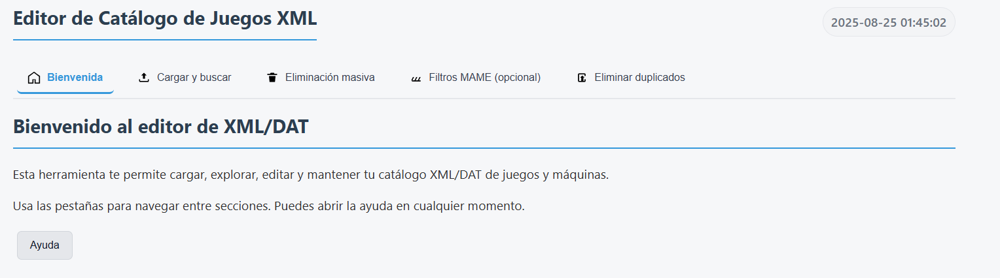
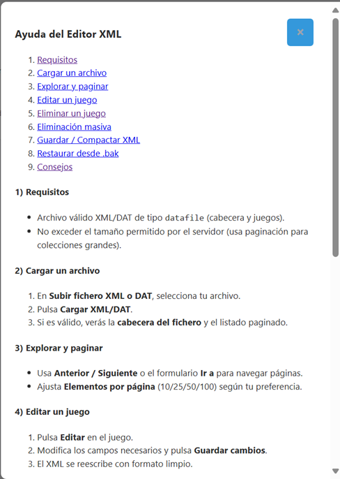

# Editor XML de Juegos y Máquinas

[](./) [](https://www.php.net/) [](./LICENSE) [](https://github.com/scorpio21/editor_Xml/issues) [](https://github.com/scorpio21/editor_Xml/commits) [](https://github.com/scorpio21/editor_Xml/stargazers)

Aplicación web en PHP para visualizar, editar y mantener ficheros XML/DAT de catálogos de juegos y máquinas (formatos tipo `datafile`, compatibles con No-Intro y MAME). Optimizada para XAMPP en Windows, compatible con cualquier servidor web con PHP 8+ y extensión DOM.

Actualizado: 2025-08-27 — ver `CHANGELOG.md` (Exportación a XML de resultados filtrados y corrección de caracteres especiales en DOM).

## Tabla de contenidos

- [Características clave](#características-clave)
- [Características](#características)
- [Por qué / Para quién](#por-qué--para-quién)
- [Pila tecnológica](#pila-tecnológica)
- [Requisitos](#requisitos)
- [Instalación](#instalación)
- [Guía de instalación (detallada)](#guía-de-instalación-detallada)
- [Estructura del proyecto](#estructura-del-proyecto)
- [Uso](#uso)
- [Interfaz por pestañas](#interfaz-por-pestañas)
- [Inicio rápido](#inicio-rápido)
- [Capturas](#capturas)
- [Notas técnicas](#notas-técnicas)
- [Buenas prácticas seguidas](#buenas-prácticas-seguidas)
- [Seguridad (pendiente/mejorable)](#seguridad-pendientemejorable)
- [Limitaciones actuales](#limitaciones-actuales)
- [Roadmap](#roadmap)
- [Changelog](#changelog)
- [Contribuir](#contribuir)
- [Reportar un problema / Solicitar mejora](#reportar-un-problema--solicitar-mejora)
- [Versionado](#versionado)
- [Soporte](#soporte)
- [Licencia](#licencia)

## Características clave

- 🚀 Edición rápida de juegos y máquinas (soporte multi‑ROM)
- 🔍 Búsqueda y filtros (incluye eliminación masiva con dry‑run)
- 🕹️ MAME: pestaña **MAME (buscar)** solo para búsqueda; eliminación individual y masiva deshabilitadas
- 🧭 Interfaz por pestañas accesible (por defecto) con navegación por teclado y ARIA
- 💾 Persistencia de pestaña activa y posición de scroll por panel (sessionStorage)
- 🧰 Mantenimiento seguro: backups automáticos y restauración desde `.bak`
- 🧹 Compactación y limpieza automática del XML al guardar
- 📄 Paginación en servidor para DATS grandes
- 🔐 Protección CSRF en todas las acciones POST
- ⬇️ Exportación a XML de resultados filtrados (sin duplicados)
- 🌐 Búsqueda externa (myrient, vimm, archive.org) por nombre y hashes (MD5/SHA1/CRC). Fase 2: botón "Comprobar Archive" con enlace directo cuando hay coincidencia.

## Características

- **Subida de XML/DAT**: carga el fichero y lo deja disponible como `uploads/current.xml`.
- **Cabecera del fichero**: muestra nombre, descripción, versión, fecha, autor y enlaces.
- **Listado con paginación**: render unificado de entradas `<game>` y `<machine>` a 1 por línea, con controles Anterior/Siguiente y “Ir a”.
- **Edición de juego/máquina (multi‑ROM)**: modal para actualizar nombre, descripción, categoría (solo `game`) y múltiples ROMs con `size`, `crc`, `md5`, `sha1`. Incluye botón para calcular hashes MD5/SHA1 desde fichero por cada ROM.
- **Campos específicos de máquinas**: visualización de `year` y `manufacturer` en la lista.
- **Eliminación individual**: borrado de un juego o una máquina concreta.
- **Eliminación masiva con filtros (juegos y máquinas)**:
  - Regiones/países a incluir.
  - Idiomas a excluir.
  - Búsqueda por: `name`, `description`, `category` (en `game`) y `year`, `manufacturer` (en `machine`).
  - Botón “Contar coincidencias” (AJAX) para previsualizar impacto.
- **Búsqueda rápida (servidor)**: cuadro de búsqueda por nombre/descr./categoría antes de paginar; preserva el término en la navegación.
- **Visualización clara de ROMs**: cada atributo (`name`, `size`, `crc`, `md5`, `sha1`) en su propia línea para mejor legibilidad.
- **Backups automáticos**: antes de guardar, se crea `uploads/current.xml.bak` y se revierte si falla la escritura.
- **Restaurar desde .bak**: botón para recuperar el XML previo.
- **Compactar XML**: limpieza de nodos de texto vacíos y guardado con indentación consistente.
- **Ayuda integrada**: botón “Ayuda” con modal explicativo paso a paso.

## Por qué / Para quién

- Personas que gestionan grandes catálogos XML/DAT (No-Intro, Redump, MAME).
- Coleccionistas que necesitan filtrar, editar y limpiar entradas con múltiples ROMs.
- Administradores que requieren backups, restauración y compactación segura del XML.

## Pila tecnológica

- PHP 8+
- Extensión DOM de PHP (para manipulación XML)
- HTML5 + CSS3 (estilos en `css/`)
- JavaScript (vanilla, en `js/`)
- XAMPP/Apache (entorno recomendado en Windows)

## Requisitos

- PHP 8.0 o superior.
- Servidor web (XAMPP recomendado). Probado en Windows.
- Extensiones PHP: DOM (activada por defecto en XAMPP 8+).
- Configuración recomendada (php.ini):
  - file_uploads = On
  - upload_max_filesize = 32M (o superior según tamaño de tus DATS)
  - post_max_size = 32M (≥ upload_max_filesize)
  - max_execution_time = 60 (ajústalo si trabajas con ficheros muy grandes)
- Carpeta `uploads/` con permisos de escritura por Apache.

## Estructura del proyecto

```text
editor_Xml/
├─ css/
│  ├─ editor-xml.css
│  └─ tabs.css                 # Estilos de la UI por pestañas
├─ js/
│  ├─ editor-xml.js
│  ├─ tabs.js                  # Componente de pestañas accesibles (ARIA + teclado)
│  └─ dedupe.js                # Lógica AJAX para eliminar duplicados
├─ inc/
│  ├─ acciones.php         # Procesa todas las acciones POST (edit, delete, bulk_delete, compact_xml, etc.)
│  ├─ csrf-helper.php      # Helpers de CSRF: generar/verificar token y campo oculto
│  ├─ xml-helpers.php      # Helpers: asegurarCarpetaUploads, guardar con backup, limpiar espacios DOM
│  └─ mame-filters.php     # Lógica específica de MAME: filtros, procesamiento y helpers de búsqueda
├─ partials/
│  ├─ header-file.php      # Cabecera de archivo actual y acciones relacionadas
│  ├─ games-list.php       # Render de la lista unificada de juegos y máquinas (paginada)
│  ├─ bulk-delete.php      # Formulario y controles de eliminación masiva (juegos y máquinas)
│  ├─ modal-edit.php       # Modal para editar juego/máquina con soporte multi-ROM
│  ├─ modal-help.php       # Modal de ayuda (uso de la app)
│  └─ sections/
│     ├─ mame-filters.php      # Controles de filtros específicos MAME (reutilizable)
│     └─ dedupe-region.php     # Formulario de eliminación de duplicados por región
├─ img/
│  ├─ ico-home.svg, ico-upload.svg, ico-bulk.svg, ico-mame.svg, ico-dedupe.svg
├─ uploads/
│  ├─ current.xml          # Fichero XML activo (se crea tras subir)
│  └─ current.xml.bak      # Copia de seguridad
├─ index.php               # Punto de entrada (UI)
├─ MEJORAS.md              # Roadmap y registro de mejoras
└─ README.md               # Este archivo
```

## Instalación

1. Descarga o clona este repositorio.
2. Copia la carpeta `editor_Xml` dentro de `D:/xampp/htdocs/` (o la ruta de tu XAMPP).
3. Inicia Apache desde el panel de control de XAMPP.
4. Verifica que PHP 8+ está activo y la extensión DOM habilitada (phpinfo()).
5. Asegúrate de que la carpeta `uploads/` existe y es escribible (se crea automáticamente si falta).
6. Abre en el navegador: `http://localhost/editor_Xml/`.
7. Opcional (VirtualHost): configura un host como `http://editor.local/` apuntando a esta carpeta.

## Guía de instalación (detallada)

### Opción A: XAMPP en Windows (recomendada)

1. Instala XAMPP 8.x y arranca Apache.
2. Clona o copia `editor_Xml` en `D:/xampp/htdocs/editor_Xml`.
3. Crea la carpeta de logs si usas ruta fuera del proyecto (opcional): `D:/xampp/logs/editor_Xml`.
4. Variables de entorno (elige una de estas formas):
   - Apache (httpd.conf o VirtualHost):

     ```apache
     SetEnv APP_ENV "production"
     SetEnv LOG_LEVEL_MIN "INFO"
     SetEnv LOG_DIR "D:/xampp/logs/editor_Xml"
     ```
   
   - Windows (Panel de control > Sistema > Configuración avanzada > Variables de entorno):

     ```cmd
     APP_ENV=production
     LOG_LEVEL_MIN=INFO
     LOG_DIR=D:\\xampp\\logs\\editor_Xml
     ```

5. Permisos: asegúrate de que `uploads/` y (si aplica) `D:/xampp/logs/editor_Xml` son escribibles por Apache.
6. php.ini (recomendado para DATS medianos/grandes):
   - `upload_max_filesize = 64M`
   - `post_max_size = 64M`
   - `max_execution_time = 90`
7. Abre `http://localhost/editor_Xml/` y verifica que carga la UI.

VirtualHost opcional (mejor DX):

```apache
<VirtualHost *:80>
    ServerName editor.local
    DocumentRoot "D:/xampp/htdocs/editor_Xml"
    <Directory "D:/xampp/htdocs/editor_Xml">
        AllowOverride All
        Require all granted
    </Directory>
    SetEnv APP_ENV "production"
    SetEnv LOG_LEVEL_MIN "INFO"
    SetEnv LOG_DIR "D:/xampp/logs/editor_Xml"
    ErrorLog "logs/editor.error.log"
    CustomLog "logs/editor.access.log" combined
</VirtualHost>
```

Añade `127.0.0.1 editor.local` al archivo `C:\\Windows\\System32\\drivers\\etc\\hosts`.

### Opción B: Servidor/CLI genérico

1. Requisitos: PHP 8+ con extensión DOM.
2. Sirve la carpeta con tu servidor web preferido o usa el built-in de PHP solo para pruebas locales:

```bash
php -S 127.0.0.1:8080 -t .
```

1. Configura variables de entorno antes de arrancar (opcional):

```bash
# Linux/macOS
export APP_ENV=development
export LOG_LEVEL_MIN=INFO
```

### Verificación rápida

- Cargar un XML/DAT y comprobar que aparece en `uploads/current.xml`.
- Probar “Guardar/Compactar” y verificar que se crea `uploads/current.xml.bak` y `logs/app.log` recibe entradas.

### Troubleshooting

- 404 o index en blanco: confirma DocumentRoot y `AllowOverride All` en el VirtualHost.
- No se escribe el log: revisa `LOG_DIR`/`LOG_PATH` y permisos; si falta, se usa `logs/app.log` dentro del proyecto.
- Fallo al subir archivos: ajusta `upload_max_filesize`/`post_max_size` y reinicia Apache.
- Mensajes de entidad XML: asegúrate de usar archivos con codificación UTF‑8; el sistema escapa contenido textual automáticamente.

## Uso

1. **Subir archivo**: selecciona un `.xml` o `.dat` y pulsa “Cargar XML/DAT”.
1. **Explorar**: usa la paginación y “Ir a” para navegar (verás juegos y máquinas).
1. **Editar**: pulsa “Editar” en un juego o una máquina, modifica y guarda.
   - Puedes añadir, eliminar o modificar múltiples ROMs por entrada.
   - Valida `size`, `crc` (8 hex), `md5` (32 hex) y `sha1` (40 hex). Puedes calcular hashes desde fichero.
   - En `machine` no aplica `category`.
1. **Eliminar**: usa “Eliminar” en un juego o una máquina, o la **Eliminación masiva** con filtros.
   - Nota MAME: en ficheros MAME la eliminación (individual y masiva) está deshabilitada.
1. **Contar coincidencias**: en masivo, usa el botón “Contar coincidencias” para ver el impacto antes de borrar.
1. **Guardar / Compactar XML**: tras una eliminación masiva, pulsa el botón para reescritura limpia del XML.
1. **Restaurar**: si lo necesitas, “Restaurar desde .bak”.
1. **Ayuda**: botón “Ayuda” (arriba) con guía paso a paso.
1. **Buscar**: utiliza el cuadro de búsqueda para filtrar por nombre/descr./categoría. El término se mantiene al paginar y cambiar "Mostrar N".
   - Nota MAME: aparece la pestaña **MAME (buscar)** con buscador por nombre, ROM y hash; sin eliminación.

1. **Exportar resultados (XML)**:

- Bajo el buscador, pulsa “Exportar resultados (XML)”.
- Se descargará un nuevo XML solo con las entradas filtradas y deduplicadas.
- Los contenidos de texto (por ejemplo `description`, `category`, `manufacturer`) se escapan correctamente para evitar errores de entidades XML.
- El nombre del archivo se sanea para ser válido en Windows.

1. **Buscar juego (externo)**:

- En la pestaña “Buscar juego”, introduce nombre y/o hashes (MD5/SHA1/CRC).
- Pulsa “Generar enlaces” para obtener enlaces de búsqueda en myrient, vimm y archive.org (mediante búsquedas `site:`) y alternativas en Google.
- Opcional: pulsa “Comprobar Archive” para consultar Archive.org y, si hay coincidencias, mostrar un enlace directo (sin scraping; usa su API de búsqueda avanzada, protegido con CSRF).
- Puedes abrir cada enlace o “Abrir todas”. Si no hay datos suficientes, se muestra un aviso.

## Interfaz por pestañas

- Por defecto, la aplicación muestra una UI por pestañas accesible.
- Navegación por teclado: Flechas Izq/Der, Home/End para moverse; Enter/Espacio para activar.
- Accesibilidad: roles ARIA (`tablist`, `tab`, `tabpanel`) y atributos gestionados por `js/tabs.js`.
- Persistencia: pestaña activa y scroll por panel se recuerdan durante la sesión (sessionStorage).
- UI clásica: si necesitas la interfaz anterior, añade `?ui=classic` a la URL.

### Diagnóstico opcional

- Para inspeccionar qué assets se cargan y el estado de las pestañas/paneles, añade `?debug=assets` a la URL.
- Esto activa trazas en consola desde `js/utils.js`, `js/tabs.js`, `js/bulk.js` y `js/dedupe.js`.
- No afecta al comportamiento de la aplicación. Pensado para verificación en desarrollo.

## Inicio rápido

1. Abre `http://localhost/editor_Xml/` en tu navegador.
2. Sube un archivo `.xml` o `.dat` (se guardará como `uploads/current.xml`).
3. Edita entradas desde la lista o el modal; usa “Contar coincidencias” antes de una eliminación masiva.
4. Guarda/Compacta y, si es necesario, restaura desde `.bak`.

## Notas técnicas

- El guardado usa `DOMDocument` con `preserveWhiteSpace = false`, `formatOutput = true` y una limpieza de nodos de texto vacíos.
- Antes de escribir, se hace copia de seguridad `.bak` y, si falla el guardado, se revierte.
- La edición multi-ROM reemplaza todos los nodos `<rom>` del elemento editado por los nuevos valores validados.
- La eliminación masiva soporta un conteo previo por AJAX y contempla nodos `<game>` y `<machine>`.
- Reloj en UI: elementos con `data-clock` muestran la hora actual del navegador, actualizada cada minuto. “Última modificación” en cabecera usa `filemtime` del XML y la zona horaria de PHP.

## Logs y errores

- Los logs se escriben mediante `inc/logger.php` con niveles (`INFO`, `ADVERTENCIA`, `ERROR`).
- Ruta del archivo: `LOG_PATH` (por defecto `logs/app.log`).
- Variables de entorno:
  - `APP_ENV`: `production` o `development`.
    - En producción se minimiza la verbosidad y los extras en logs.
  - `LOG_LEVEL_MIN`: nivel mínimo a registrar (`INFO`/`ADVERTENCIA`/`ERROR`).
  - `LOG_DIR`: carpeta de logs. Recomendado fuera del docroot (ej.: `D:/xampp/logs/editor_Xml`).
- Rotación simple: cuando el archivo supera ~2 MB se rota a `app.log.1`.
- Seguridad: no se registran datos sensibles; los mensajes se sanitizan.

Ejemplos de configuración:

Apache (VirtualHost o httpd.conf):

```apache
SetEnv APP_ENV "production"
SetEnv LOG_LEVEL_MIN "INFO"
SetEnv LOG_DIR "D:/xampp/logs/editor_Xml"
```

Windows (Variables del sistema):

```cmd
APP_ENV=production
LOG_LEVEL_MIN=INFO
LOG_DIR=D:\\xampp\\logs\\editor_Xml
```

Ubicación de archivos:

- Por defecto: `logs/` dentro del proyecto.
- Si `LOG_DIR` está definido y existe, se usa ese directorio.

## Buenas prácticas seguidas

- Código y textos en **español**.
- CSS en `css/`, JS en `js/`, sin estilos ni scripts embebidos.
- Manejo básico de errores mediante mensajes de sesión.
- Evitamos duplicación de lógica con helpers en `inc/xml-helpers.php`.

## Seguridad (pendiente/mejorable)

- Validaciones más estrictas de entrada (tipos y formatos de `crc`, `md5`, `sha1`).
- CSRF: implementado en todos los formularios POST críticos y verificado en servidor. Ver detalle en [`CHANGELOG.md`](./CHANGELOG.md).
- Protección de la carpeta `uploads/` (si aplica en tu entorno) con `.htaccess`.

## Limitaciones actuales

- Rendimiento: los DATS muy grandes pueden tardar en procesarse en equipos modestos.
- Validaciones avanzadas de entrada: pueden ampliarse (más mensajes y reglas específicas).
- i18n: actualmente interfaz en español; multi‑idioma pendiente.
- Pruebas automáticas: unitarias e integración aún por completar.

## Roadmap

Revisa [`MEJORAS.md`](./MEJORAS.md) para el roadmap detallado, mejoras planificadas y progreso reciente.

- Milestone v1.0 (issues priorizados): [ver en GitHub](https://github.com/scorpio21/editor_Xml/issues?q=is%3Aissue+milestone%3A%22v1.0%22)
- Milestone v1.1 (siguientes iteraciones): [ver en GitHub](https://github.com/scorpio21/editor_Xml/issues?q=is%3Aissue+milestone%3A%22v1.1%22)
- Project "Editor XML Roadmap" (tablero): [Project 5](https://github.com/users/scorpio21/projects/5)

## Changelog

Consulta el historial de cambios en [`CHANGELOG.md`](./CHANGELOG.md).

## Contribuir

1. Crea un fork y una rama feature: `feature/mi-mejora`.
2. Sigue el estilo del proyecto (PHP 8+, funciones en español, CSS/JS separados).
3. Envía un PR con una descripción clara.

## Reportar un problema / Solicitar mejora

- Abre un issue desde GitHub: [Elegir plantilla](https://github.com/scorpio21/editor_Xml/issues/new/choose)
- Si no usas plantilla: [Nuevo issue](https://github.com/scorpio21/editor_Xml/issues/new)

## Licencia

Este proyecto está licenciado bajo los términos de la **MIT License**. Consulta el archivo [`LICENSE`](./LICENSE) para más información.

## Versionado

Se sigue un esquema inspirado en [SemVer](https://semver.org/lang/es/): `MAJOR.MINOR.PATCH`.

- Cambios incompatibles: incremento de `MAJOR`.
- Funcionalidad retrocompatible: incremento de `MINOR`.
- Corrección de errores: incremento de `PATCH`.

Se recomienda usar tags en Git para marcar versiones estables.

## Soporte

- Abre un issue en GitHub describiendo claramente el problema o la propuesta.
- Incluye pasos de reproducción, capturas y, si aplica, fragmentos de XML (sin datos sensibles).

## Capturas

Puedes añadir capturas en la carpeta `img/` y referenciarlas aquí. Ejemplos:



