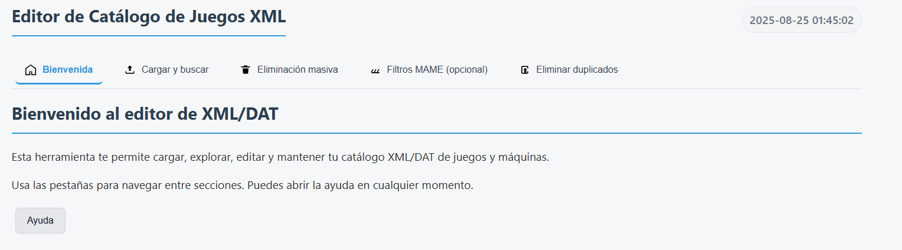
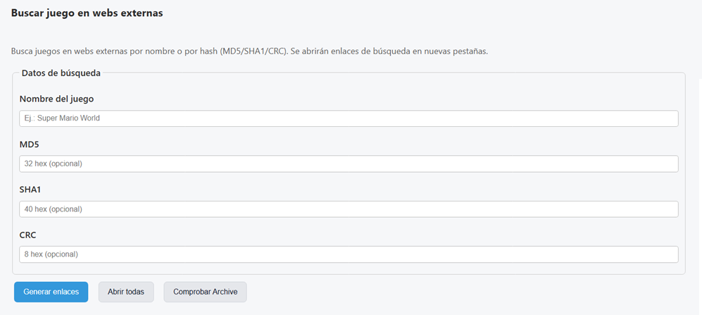
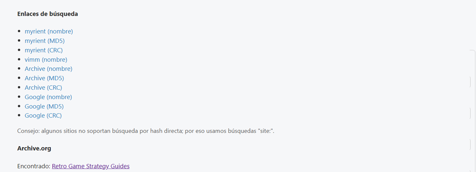
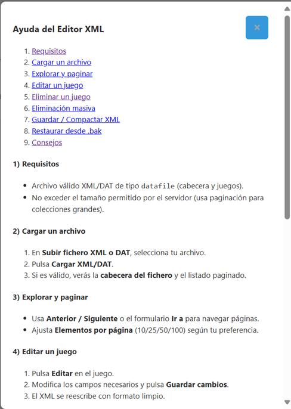

# Editor XML de Juegos y Máquinas

[](./) [](https://www.php.net/) [](./LICENSE) [](https://github.com/scorpio21/editor_Xml/issues) [](https://github.com/scorpio21/editor_Xml/commits) [](https://github.com/scorpio21/editor_Xml/stargazers)

Aplicación web en PHP para visualizar, editar y mantener ficheros XML/DAT de catálogos de juegos y máquinas (formatos tipo `datafile`, compatibles con No-Intro y MAME). Optimizada para XAMPP en Windows, compatible con cualquier servidor web con PHP 8+ y extensión DOM.

Actualizado: 2025-11-20 — ver `CHANGELOG.md` (Solapa "Categorías" afinada: nombre/header/archivo alineados; nueva solapa "Regiones" con conteo/export XML/CSV por región; fixes adicionales de sanitización y cabeceras en descargas).

## Tabla de contenidos

- [Características clave](#características-clave)
- [Características](#características)
- [Por qué / Para quién](#por-qué--para-quién)
- [Pila tecnológica](#pila-tecnológica)
- [Requisitos](#requisitos)
- [Instalación](#instalación)
- [Guía de instalación (detallada)](#guía-de-instalación-detallada)
- [Estructura del proyecto](#estructura-del-proyecto)
- [Uso](#uso)
- [Interfaz por pestañas](#interfaz-por-pestañas)
- [Inicio rápido](#inicio-rápido)
- [Capturas](#capturas)
- [Notas técnicas](#notas-técnicas)
- [Buenas prácticas seguidas](#buenas-prácticas-seguidas)
- [Seguridad (pendiente/mejorable)](#seguridad-pendientemejorable)
- [Seguridad XML (XXE)](#seguridad-xml-xxe)
- [Limitaciones actuales](#limitaciones-actuales)
- [Roadmap](#roadmap)
- [Changelog](#changelog)
- [Contribuir](#contribuir)
- [Reportar un problema / Solicitar mejora](#reportar-un-problema--solicitar-mejora)
- [Versionado](#versionado)
- [Soporte](#soporte)
- [Licencia](#licencia)

## Características clave

- 🚀 Edición rápida de juegos y máquinas (soporte multi‑ROM)
- 🔍 Búsqueda y filtros (incluye eliminación masiva con dry‑run)
- 🕹️ MAME: pestaña **MAME (buscar)** solo para búsqueda; eliminación individual y masiva deshabilitadas
- 🧭 Interfaz por pestañas accesible (por defecto) con navegación por teclado y ARIA
- 💾 Persistencia de pestaña activa y posición de scroll por panel (sessionStorage)
- 🧰 Mantenimiento seguro: backups automáticos y restauración desde `.bak`
- 🧹 Compactación y limpieza automática del XML al guardar
- 📄 Paginación en servidor para DATS grandes
- 🔐 Protección CSRF en todas las acciones POST
- ⬇️ Exportación a XML de resultados filtrados (sin duplicados)
- 🌐 Búsqueda externa (myrient, vimm, archive.org) por nombre y hashes (MD5/SHA1/CRC). Fase 2: botón "Comprobar Archive" con enlace directo cuando hay coincidencia.
- 🗂️ Operaciones por categorías: categorías dinámicas desde el XML; contar, eliminar en el XML cargado y exportar coincidencias a nuevo XML (nombre y header consistentes)
  - UX: botones "Seleccionar todo", "Ninguno", "Invertir"
  - Editor de descripción: bloque para editar `header/description` con sugerencia
- 🌍 Solapa **Regiones**: seleccionar una o varias regiones (Japon, Europa, Francia, etc.) y:
  - Contar coincidencias
  - Exportar a XML solo con esas entradas (cabecera y nombre del archivo coherentes)
  - Exportar a CSV para análisis externo (tipo, nombre, descripción, extra)
- 🔄 Solapa **Duplicados**: gestión inteligente de juegos duplicados:
  - Detección automática agrupando por nombre base (ignora región, idiomas, revisiones)
  - Visualización de grupos con todas las variantes disponibles
  - Selección manual de qué versión mantener en cada grupo
  - Sugerencias automáticas: priorizar versiones originales, con español, o última revisión
  - Exportar lista de duplicados a CSV para revisión
  - Generar nuevo XML/DAT sin los duplicados seleccionados para eliminar

## Características

- **Subida de XML/DAT**: carga el fichero y lo deja disponible como `uploads/current.xml`.
- **Cabecera del fichero**: muestra nombre, descripción, versión, fecha, autor y enlaces.
- **Listado con paginación**: render unificado de entradas `<game>` y `<machine>` a 1 por línea, con controles Anterior/Siguiente y “Ir a”.
- **Edición de juego/máquina (multi‑ROM)**: modal para actualizar nombre, descripción, categoría (solo `game`) y múltiples ROMs con `size`, `crc`, `md5`, `sha1`. Incluye botón para calcular hashes MD5/SHA1 desde fichero por cada ROM.
- **Campos específicos de máquinas**: visualización de `year` y `manufacturer` en la lista.
- **Eliminación individual**: borrado de un juego o una máquina concreta.
- **Eliminación masiva con filtros (juegos y máquinas)**:
  - Regiones/países a incluir.
  - Idiomas a excluir.
  - Búsqueda por: `name`, `description`, `category` (en `game`) y `year`, `manufacturer` (en `machine`).
  - Botón “Contar coincidencias” (AJAX) para previsualizar impacto.
- **Búsqueda rápida (servidor)**: cuadro de búsqueda por nombre/descr./categoría antes de paginar; preserva el término en la navegación.
- **Visualización clara de ROMs**: cada atributo (`name`, `size`, `crc`, `md5`, `sha1`) en su propia línea para mejor legibilidad.
- **Backups automáticos**: antes de guardar, se crea `uploads/current.xml.bak` y se revierte si falla la escritura.
- **Restaurar desde .bak**: botón para recuperar el XML previo.
- **Compactar XML**: limpieza de nodos de texto vacíos y guardado con indentación consistente.
- **Ayuda integrada**: botón “Ayuda” con modal explicativo paso a paso.

## Por qué / Para quién

- Personas que gestionan grandes catálogos XML/DAT (No-Intro, Redump, MAME).
- Coleccionistas que necesitan filtrar, editar y limpiar entradas con múltiples ROMs.
- Administradores que requieren backups, restauración y compactación segura del XML.

## Pila tecnológica

- PHP 8+
- Extensión DOM de PHP (para manipulación XML)
- HTML5 + CSS3 (estilos en `css/`)
- JavaScript (vanilla, en `js/`)
- XAMPP/Apache (entorno recomendado en Windows)

## Requisitos

- PHP 8.0 o superior.
- Servidor web (XAMPP recomendado). Probado en Windows.
- Extensiones PHP: DOM (activada por defecto en XAMPP 8+).
- Configuración recomendada (php.ini):
  - file_uploads = On
  - upload_max_filesize = 32M (o superior según tamaño de tus DATS)
  - post_max_size = 32M (≥ upload_max_filesize)
  - max_execution_time = 60 (ajústalo si trabajas con ficheros muy grandes)
- Carpeta `uploads/` con permisos de escritura por Apache.

## Estructura del proyecto

```text
editor_Xml/
├─ css/
│  ├─ editor-xml.css           # Estilos principales de la app
│  ├─ tabs.css                 # Estilos de la UI por pestañas
│  └─ search-external.css      # Estilos del buscador externo
├─ js/
│  ├─ bulk.js                  # Lógica de eliminación masiva
│  ├─ dedupe.js                # Lógica de deduplicación por región
│  ├─ hashes.js                # Cálculo/gestión de hashes (MD5/SHA1/CRC)
│  ├─ modales.js               # Comportamiento de modales y UI
│  └─ ...                      # Otros utilitarios de interfaz
├─ inc/
│  ├─ EditorXml.php            # Utilidades XML centralizadas (fachada)
│  ├─ acciones.php             # Enrutador de acciones POST
│  ├─ config.php               # Configuración de app
│  ├─ acciones/                # Acciones específicas (módulos)
│  │  ├─ bulk.php              # Acciones de eliminación masiva y helpers
│  │  ├─ common.php            # Utilidades compartidas de acciones
│  │  ├─ crud.php              # Operaciones CRUD
│  │  ├─ category.php          # Acciones por categorías (contar/eliminar/exportar)
│  │  └─ ...                   # Otras acciones
│  └─ ...                      # Otros helpers (CSRF, XML, logger, etc.)
├─ partials/
│  ├─ header-file.php          # Cabecera del archivo actual y acciones
│  ├─ games-list.php           # Render de la lista unificada (paginada)
│  ├─ bulk-delete.php          # Formulario y controles de eliminación masiva
│  ├─ sections/
│  │  ├─ mame-filters.php      # Controles/filtros específicos de MAME
│  │  ├─ dedupe-region.php     # Formulario de deduplicados por región
│  │  ├─ search-external.php   # Buscador externo por nombre y hashes
│  │  └─ category-ops.php      # UI de operaciones por categorías
│  └─ ...
├─ img/
│  ├─ flags/                   # Banderas de idioma (i18n)
│  │  ├─ es.svg
│  │  └─ gb.svg
│  ├─ captura-*.png            # Capturas para el README
│  └─ *.svg                    # Iconos de la interfaz
├─ test/
│  ├─ editorxml_test.php       # Pruebas unitarias
│  ├─ integration_actions_test.php
│  ├─ integration_harness_runner.php
│  └─ xml_helpers_test.php
├─ index.php                   # Punto de entrada (UI)
├─ .gitignore
├─ CHANGELOG.md
├─ LICENSE
├─ MEJORAS.md
└─ README.md
```

## Instalación

1. Descarga o clona este repositorio.
2. Copia la carpeta `editor_Xml` dentro de `D:/xampp/htdocs/` (o la ruta de tu XAMPP).
3. Inicia Apache desde el panel de control de XAMPP.
4. Verifica que PHP 8+ está activo y la extensión DOM habilitada (phpinfo()).
5. Asegúrate de que la carpeta `uploads/` existe y es escribible (se crea automáticamente si falta).
6. Abre en el navegador: `http://localhost/editor_Xml/`.
7. Opcional (VirtualHost): configura un host como `http://editor.local/` apuntando a esta carpeta.

## Guía de instalación (detallada)

### Opción A: XAMPP en Windows (recomendada)

1. Instala XAMPP 8.x y arranca Apache.
2. Clona o copia `editor_Xml` en `D:/xampp/htdocs/editor_Xml`.
3. Crea la carpeta de logs si usas ruta fuera del proyecto (opcional): `D:/xampp/logs/editor_Xml`.
4. Variables de entorno (elige una de estas formas):
   - Apache (httpd.conf o VirtualHost):

     ```apache
     SetEnv APP_ENV "production"
     SetEnv LOG_LEVEL_MIN "INFO"
     SetEnv LOG_DIR "D:/xampp/logs/editor_Xml"
     ```

- Windows (Panel de control > Sistema > Configuración avanzada > Variables de entorno):

     ```cmd
     APP_ENV=production
     LOG_LEVEL_MIN=INFO
     LOG_DIR=D:\\xampp\\logs\\editor_Xml
     ```

1. Permisos: asegúrate de que `uploads/` y (si aplica) `D:/xampp/logs/editor_Xml` son escribibles por Apache.
2. php.ini (recomendado para DATS medianos/grandes):
   - `upload_max_filesize = 64M`
   - `post_max_size = 64M`
   - `max_execution_time = 90`
3. Abre `http://localhost/editor_Xml/` y verifica que carga la UI.

VirtualHost opcional (mejor DX):

```apache
<VirtualHost *:80>
    ServerName editor.local
    DocumentRoot "D:/xampp/htdocs/editor_Xml"
    <Directory "D:/xampp/htdocs/editor_Xml">
        AllowOverride All
        Require all granted
    </Directory>
    SetEnv APP_ENV "production"
    SetEnv LOG_LEVEL_MIN "INFO"
    SetEnv LOG_DIR "D:/xampp/logs/editor_Xml"
    ErrorLog "logs/editor.error.log"
    CustomLog "logs/editor.access.log" combined
</VirtualHost>
```

Añade `127.0.0.1 editor.local` al archivo `C:\\Windows\\System32\\drivers\\etc\\hosts`.

### Opción B: Servidor/CLI genérico

1. Requisitos: PHP 8+ con extensión DOM.
2. Sirve la carpeta con tu servidor web preferido o usa el built-in de PHP solo para pruebas locales:

```bash
php -S 127.0.0.1:8080 -t .
```

1. Configura variables de entorno antes de arrancar (opcional):

```bash
# Linux/macOS
export APP_ENV=development
export LOG_LEVEL_MIN=INFO
```

### Verificación rápida

- Cargar un XML/DAT y comprobar que aparece en `uploads/current.xml`.
- Probar “Guardar/Compactar” y verificar que se crea `uploads/current.xml.bak` y `logs/app.log` recibe entradas.

### Troubleshooting

- 404 o index en blanco: confirma DocumentRoot y `AllowOverride All` en el VirtualHost.
- No se escribe el log: revisa `LOG_DIR`/`LOG_PATH` y permisos; si falta, se usa `logs/app.log` dentro del proyecto.
- Fallo al subir archivos: ajusta `upload_max_filesize`/`post_max_size` y reinicia Apache.
- Mensajes de entidad XML: asegúrate de usar archivos con codificación UTF‑8; el sistema escapa contenido textual automáticamente.

## Uso

1. **Subir archivo**: selecciona un `.xml` o `.dat` y pulsa “Cargar XML/DAT”.
1. **Explorar**: usa la paginación y “Ir a” para navegar (verás juegos y máquinas).
1. **Editar**: pulsa “Editar” en un juego o una máquina, modifica y guarda.
   - Puedes añadir, eliminar o modificar múltiples ROMs por entrada.
   - Valida `size`, `crc` (8 hex), `md5` (32 hex) y `sha1` (40 hex). Puedes calcular hashes desde fichero.
   - En `machine` no aplica `category`.
1. **Eliminar**: usa “Eliminar” en un juego o una máquina, o la **Eliminación masiva** con filtros.
   - Nota MAME: en ficheros MAME la eliminación (individual y masiva) está deshabilitada.
1. **Contar coincidencias**: en masivo, usa el botón “Contar coincidencias” para ver el impacto antes de borrar.
1. **Guardar / Compactar XML**: tras una eliminación masiva, pulsa el botón para reescritura limpia del XML.
1. **Restaurar**: si lo necesitas, “Restaurar desde .bak”.
1. **Ayuda**: botón “Ayuda” (arriba) con guía paso a paso.
1. **Buscar**: utiliza el cuadro de búsqueda para filtrar por nombre/descr./categoría. El término se mantiene al paginar y cambiar "Mostrar N".
   - Nota MAME: aparece la pestaña **MAME (buscar)** con buscador por nombre, ROM y hash; sin eliminación.

### Flujo: Compactar y Descargar

- **Compactar XML** (`compact_xml`): limpia y formatea el XML y lo guarda SOBRE EL MISMO archivo. Crea copia `*.bak` antes de escribir. No descarga nada.
- **Descargar XML** (`download_xml`): envía el fichero actual (ya compactado si lo hiciste antes) con nombre amigable y conteo de entradas. No modifica el archivo.
- Recomendado: primero “Compactar XML”, luego “Descargar XML”.

1. **Exportar resultados (XML)**:

- Bajo el buscador, pulsa “Exportar resultados (XML)”.
- Se descargará un nuevo XML solo con las entradas filtradas y deduplicadas.
- Los contenidos de texto (por ejemplo `description`, `category`, `manufacturer`) se escapan correctamente para evitar errores de entidades XML.
- El nombre del archivo se sanea para ser válido en Windows.

1. **Exportar por categorías** (pestaña "Categorías"):

- Selecciona una o varias categorías detectadas automáticamente del fichero.
- "Contar coincidencias" para previsualizar, "Eliminar por categoría" para borrar del XML cargado, y "Exportar coincidencias a XML" para descargar.
- El nombre de exportación sigue el patrón: `<Plataforma> - Datfile (N) (YYYY-MM-DD HH-mm-ss).ext` usando la extensión original (`.xml`/`.dat`).
- El `header` del XML exportado se reconstruye en orden: `name`, `description`, `version`, `date`, seguido de otros campos (`author`, `homepage`, `url`).
- En la misma pestaña puedes editar `header/description`; se propone una sugerencia con base + conteo + fecha.

1. **Exportar por regiones** (pestaña "Regiones"):

- Selecciona una o varias regiones (Japon, Europa, Francia, USA, etc.).
- "Contar coincidencias" muestra cuántas entradas pertenecen a esas regiones.
- "Exportar por región (XML)" genera un nuevo `datafile` con solo esas entradas y un `header` actualizado (`name`, `description` con conteo real, `version`, `date`, y los campos de autor/página originales).
- "Exportar por región (CSV)" descarga un CSV (UTF-8 con BOM) con columnas `tipo`, `nombre`, `descripcion` y `extra` (categoría o año+fabricante), ideal para abrir en Excel.

1. **Buscar juego (externo)**:

- En la pestaña “Buscar juego”, introduce nombre y/o hashes (MD5/SHA1/CRC).
- Pulsa “Generar enlaces” para obtener enlaces de búsqueda en myrient, vimm y archive.org (mediante búsquedas `site:`) y alternativas en Google.
- Opcional: pulsa “Comprobar Archive” para consultar Archive.org y, si hay coincidencias, mostrar un enlace directo (sin scraping; usa su API de búsqueda avanzada, protegido con CSRF).
- Puedes abrir cada enlace o “Abrir todas”. Si no hay datos suficientes, se muestra un aviso.

## Interfaz por pestañas

- Por defecto, la aplicación muestra una UI por pestañas accesible.
- Navegación por teclado: Flechas Izq/Der, Home/End para moverse; Enter/Espacio para activar.
- Accesibilidad: roles ARIA (`tablist`, `tab`, `tabpanel`) y atributos gestionados por `js/tabs.js`.
- Persistencia: pestaña activa y scroll por panel se recuerdan durante la sesión (sessionStorage).
- UI clásica: si necesitas la interfaz anterior, añade `?ui=classic` a la URL.

### Diagnóstico opcional

- Para inspeccionar qué assets se cargan y el estado de las pestañas/paneles, añade `?debug=assets` a la URL.
- Esto activa trazas en consola desde `js/utils.js`, `js/tabs.js`, `js/bulk.js` y `js/dedupe.js`.
- No afecta al comportamiento de la aplicación. Pensado para verificación en desarrollo.

## Inicio rápido

1. Abre `http://localhost/editor_Xml/` en tu navegador.
2. Sube un archivo `.xml` o `.dat` (se guardará como `uploads/current.xml`).
3. Edita entradas desde la lista o el modal; usa “Contar coincidencias” antes de una eliminación masiva.
4. Guarda/Compacta y, si es necesario, restaura desde `.bak`.

## Notas técnicas

- El guardado usa `DOMDocument` con `preserveWhiteSpace = false`, `formatOutput = true` y una limpieza de nodos de texto vacíos.
- Antes de escribir, se hace copia de seguridad `.bak` y, si falla el guardado, se revierte.
- La edición multi-ROM reemplaza todos los nodos `<rom>` del elemento editado por los nuevos valores validados.
- La eliminación masiva soporta un conteo previo por AJAX y contempla nodos `<game>` y `<machine>`.
- Reloj en UI: elementos con `data-clock` muestran la hora actual del navegador, actualizada cada minuto. “Última modificación” en cabecera usa `filemtime` del XML y la zona horaria de PHP.
- Centralización de helpers XML: las acciones usan `EditorXml::<método>()` (por ejemplo, `guardarDomConBackup`, `limpiarEspaciosEnBlancoDom`, `tokenizar`) que delegan en `inc/xml-helpers.php`.

## Seguridad XML (XXE)

- Saneado automático de `<!DOCTYPE>` (con o sin subset interno) al cargar XML en `inc/xml-helpers.php::cargarXmlSiDisponible()`.
- Escapado de entidades no declaradas tras eliminar la DTD para evitar errores de parseo (por ejemplo, `&xxe;` → `&amp;xxe;`).
- Carga sin red usando `LIBXML_NONET` en SimpleXML y DOM.
- Flags seguros en DOM: `resolveExternals = false`, `substituteEntities = false`, `validateOnParse = false`.
- Persistencia del XML saneado sin DOCTYPE en disco para evitar avisos repetidos, con aviso único en la UI por sesión.
- Referencias: `CHANGELOG.md` (2025-08-29), `partials/modal-help.php`, `test/xxe_security_test.php`.

## Pruebas de integración

Para validar el flujo principal de acciones XML sin afectar datos reales, el proyecto incluye:

- **Script E2E**: `test/integration_actions_test.php` (flujo: create_xml → add_game → compact_xml → download_xml).
- **Harness**: `test/integration_harness_runner.php` para invocar acciones individuales con variables de entorno.

### Ejecutar tests

Ejemplos rápidos para Windows. Ajusta rutas según tu instalación (XAMPP en `D:\xampp`).

PowerShell (recomendado):

```powershell
# Test unitario de seguridad XXE
D:\xampp\php\php.exe -d display_errors=1 -d error_reporting=E_ALL test\xxe_security_test.php

# Runner de integración: compactar XML temporal
$env:ACTION="compact_xml"; $env:XML_PATH="$env:TEMP\current.xml"; D:\xampp\php\php.exe test\integration_harness_runner.php

# Runner: descargar XML a archivo
$env:ACTION="download_xml"; $env:XML_PATH="$env:TEMP\current.xml"; D:\xampp\php\php.exe test\integration_harness_runner.php > downloaded.xml
```

cmd (símbolo del sistema):

```cmd
:: Test unitario de seguridad XXE
D:\xampp\php\php.exe -d display_errors=1 -d error_reporting=E_ALL test\xxe_security_test.php

:: Runner de integración con variables de entorno
set ACTION=compact_xml& set XML_PATH=%TEMP%\current.xml & D:\xampp\php\php.exe test\integration_harness_runner.php
```

Con `php` en PATH (opcional):

```powershell
php -d display_errors=1 -d error_reporting=E_ALL test/xxe_security_test.php
```

Ejecutar prueba E2E (Windows/XAMPP):

```powershell
D:\xampp\php\php.exe test\integration_actions_test.php
```

Resultado esperado: `OK: integración E2E completada.` y artefactos en `uploads/itests_e2e/`.

Ejemplos de uso del harness (PowerShell):

```powershell
# Crear XML aislado
$env:ACTION="create_xml"; $env:XML_PATH="d:\xampp\htdocs\editor_Xml\uploads\itests\current.xml"; \
  D:\xampp\php\php.exe test\integration_harness_runner.php

# Añadir juego
$env:ACTION="add_game"; $env:XML_PATH="d:\xampp\htdocs\editor_Xml\uploads\itests\current.xml"; \
$env:EXTRA_JSON='{"game_name":"Pac-Man","description":"Arcade clásico","category":"Arcade","rom_name":["pacman.rom"],"size":["16384"],"crc":["0123ABCD"],"md5":["0123456789abcdef0123456789abcdef"],"sha1":["0123456789abcdef0123456789abcdef01234567"]}'; \
  D:\xampp\php\php.exe test\integration_harness_runner.php

# Compactar
$env:ACTION="compact_xml"; $env:XML_PATH="d:\xampp\htdocs\editor_Xml\uploads\itests\current.xml"; \
  D:\xampp\php\php.exe test\integration_harness_runner.php

# Descargar a archivo
$env:ACTION="download_xml"; $env:XML_PATH="d:\xampp\htdocs\editor_Xml\uploads\itests\current.xml"; \
  D:\xampp\php\php.exe test\integration_harness_runner.php > uploads\itests\downloaded.xml

# Editar una entrada (índice 0, tipo game)
$env:ACTION="edit"; $env:XML_PATH="d:\xampp\htdocs\editor_Xml\uploads\itests\current.xml"; \
$env:EXTRA_JSON='{"index":0,"node_type":"game","game_name":"Pac-Man Plus","description":"Versión mejorada","category":"Arcade","rom_name":["pacmanp.rom"],"size":["32768"],"crc":["89ABCDEF"],"md5":["abcdef0123456789abcdef0123456789"],"sha1":["abcdef0123456789abcdef0123456789abcdef0123"]}'; \
  D:\xampp\php\php.exe test\integration_harness_runner.php

# Eliminar una entrada (índice 0, tipo game)
$env:ACTION="delete"; $env:XML_PATH="d:\xampp\htdocs\editor_Xml\uploads\itests\current.xml"; \
$env:EXTRA_JSON='{"index":0,"node_type":"game"}'; \
  D:\xampp\php\php.exe test\integration_harness_runner.php
```

Notas:

- `XML_PATH` apunta a una ruta dentro de `uploads/itests*/` para aislar los datos.
- `EXTRA_JSON` permite pasar campos adicionales (por ejemplo, para `add_game`, `edit`, `create_xml`).

## Logs y errores

- Los logs se escriben mediante `inc/logger.php` con niveles (`INFO`, `ADVERTENCIA`, `ERROR`).
- Ruta del archivo: `LOG_PATH` (por defecto `logs/app.log`).
- Variables de entorno:
  - `APP_ENV`: `production` o `development`.
    - En producción se minimiza la verbosidad y los extras en logs.
  - `LOG_LEVEL_MIN`: nivel mínimo a registrar (`INFO`/`ADVERTENCIA`/`ERROR`).
  - `LOG_DIR`: carpeta de logs. Recomendado fuera del docroot (ej.: `D:/xampp/logs/editor_Xml`).
- Rotación simple: cuando el archivo supera ~2 MB se rota a `app.log.1`.
- Seguridad: no se registran datos sensibles; los mensajes se sanitizan.

Ejemplos de configuración:

Apache (VirtualHost o httpd.conf):

```apache
SetEnv APP_ENV "production"
SetEnv LOG_LEVEL_MIN "INFO"
SetEnv LOG_DIR "D:/xampp/logs/editor_Xml"
```

Windows (Variables del sistema):

```cmd
APP_ENV=production
LOG_LEVEL_MIN=INFO
LOG_DIR=D:\\xampp\\logs\\editor_Xml
```

Ubicación de archivos:

- Por defecto: `logs/` dentro del proyecto.
- Si `LOG_DIR` está definido y existe, se usa ese directorio.

## Buenas prácticas seguidas

- Código y textos en **español**.
- CSS en `css/`, JS en `js/`, sin estilos ni scripts embebidos.
- Manejo básico de errores mediante mensajes de sesión.
- Evitamos duplicación de lógica con helpers en `inc/xml-helpers.php`.

## Seguridad (pendiente/mejorable)

- Validaciones más estrictas de entrada (tipos y formatos de `crc`, `md5`, `sha1`).
- CSRF: implementado en todos los formularios POST críticos y verificado en servidor. Ver detalle en [`CHANGELOG.md`](./CHANGELOG.md).
- Protección de la carpeta `uploads/` (si aplica en tu entorno) con `.htaccess`.

## Limitaciones actuales

- Rendimiento: los DATS muy grandes pueden tardar en procesarse en equipos modestos.
- Validaciones avanzadas de entrada: pueden ampliarse (más mensajes y reglas específicas).
- i18n: actualmente interfaz en español; multi‑idioma pendiente.
- Pruebas automáticas: unitarias e integración aún por completar.

## Roadmap

Revisa [`MEJORAS.md`](./MEJORAS.md) para el roadmap detallado, mejoras planificadas y progreso reciente.

- Milestone v1.0 (issues priorizados): [ver en GitHub](https://github.com/scorpio21/editor_Xml/issues?q=is%3Aissue+milestone%3A%22v1.0%22)
- Milestone v1.1 (siguientes iteraciones): [ver en GitHub](https://github.com/scorpio21/editor_Xml/issues?q=is%3Aissue+milestone%3A%22v1.1%22)
- Project "Editor XML Roadmap" (tablero): [Project 5](https://github.com/users/scorpio21/projects/5)

## Changelog

Consulta el historial de cambios en [`CHANGELOG.md`](./CHANGELOG.md).

## Wiki

Documentación extendida, guías y decisiones de diseño en el Wiki de GitHub:

- [Wiki de GitHub](https://github.com/scorpio21/editor_Xml/wiki)

Borradores locales para copiar/pegar en el Wiki:

- Carpeta `docs/wiki/` dentro del repositorio.

## Contribuir

1. Crea un fork y una rama feature: `feature/mi-mejora`.
2. Sigue el estilo del proyecto (PHP 8+, funciones en español, CSS/JS separados).
3. Envía un PR con una descripción clara.

## Reportar un problema / Solicitar mejora

- Abre un issue desde GitHub: [Elegir plantilla](https://github.com/scorpio21/editor_Xml/issues/new/choose)
- Si no usas plantilla: [Nuevo issue](https://github.com/scorpio21/editor_Xml/issues/new)

## Licencia

Este proyecto está licenciado bajo los términos de la **MIT License**. Consulta el archivo [`LICENSE`](./LICENSE) para más información.

## Versionado

Se sigue un esquema inspirado en [SemVer](https://semver.org/lang/es/): `MAJOR.MINOR.PATCH`.

- Cambios incompatibles: incremento de `MAJOR`.
- Funcionalidad retrocompatible: incremento de `MINOR`.
- Corrección de errores: incremento de `PATCH`.

Se recomienda usar tags en Git para marcar versiones estables.

## Soporte

- Abre un issue en GitHub describiendo claramente el problema o la propuesta.
- Incluye pasos de reproducción, capturas y, si aplica, fragmentos de XML (sin datos sensibles).

## Capturas

Las capturas se guardan en `img/`.

- **Pantalla principal**

  

- **Selector de idioma** (ES/EN por banderas, persistencia en localStorage)

  

- **Buscador externo** (nombre y hashes; enlaces y “Comprobar Archive”)

  

- **Exportar resultados (XML)**

  

- **Modal de ayuda**

  

Nota: si alguna imagen no aparece, súbela a `img/` con el nombre indicado.
